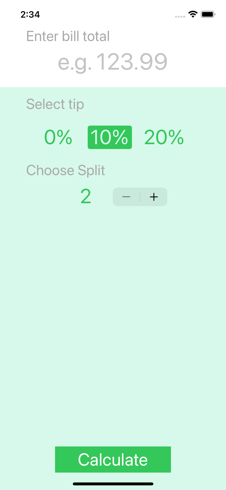
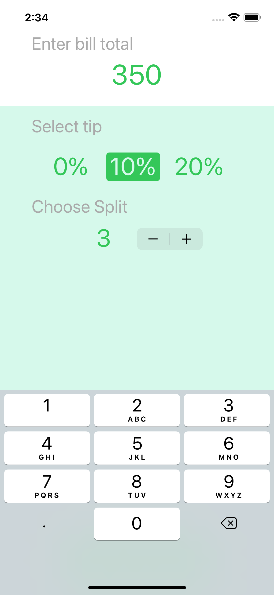
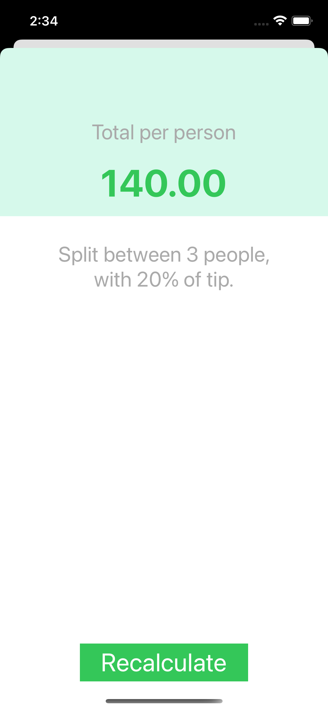

# Tip-Calculator

Calculate the tip amount for your bill. Includes the ability to split the cost between any number of people.

e.g. By using the Tip Calculator, it helps you to work out $386.50 split between 5 people with a 20 percent tip.

 
<h4>Calculator View</h4>

 

<h4>Input the bill total, select the tip percent and split number.</h4>

 

<h4>Result View</h4>

